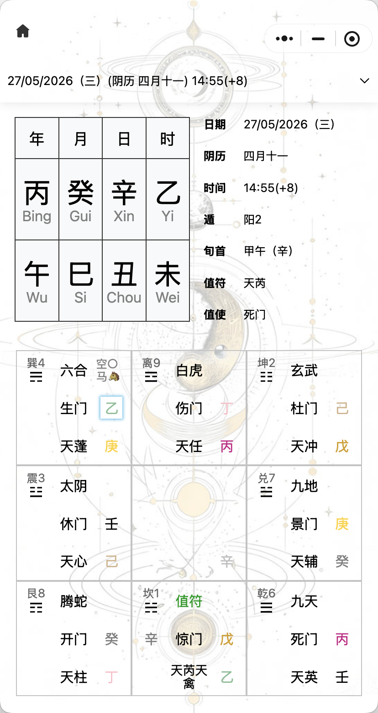

# qimenjs

## 显明奇门排盘算法



展示了一种奇门排盘算法，输入日期获取排盘结果。

可以在小程序「指个明路」进行体验。


## 使用方法

```sh
$ npm install qimenjs
```

```javascript
import qimenjs from 'qimenjs'

const qimenResult = qimenjs().main(new Date())
console.log(qimenResult)
```
+ qimenResult 结果

> 以 2026/5/27 14:55 时刻的排盘结果为例

|字段名|含义|举例|
|:--:|:--:|:--:|
|ym| 公历 日/月/年(周) | 27/05/2026（三）|
|dateLunar| 农历月日 | 四月十一|
|hm| 时分(时区) | 14:55(+8)|
|yearZhu| 年柱 | '丙午',|
|monthZhu| 月柱 | '癸巳',|
|dayZhu| 日柱 | '辛丑',|
|timeZhu| 时柱 | '乙未',|
|dun| 阴阳遁 | 阳|
|jushu| 局数 | 2|
|xunshou| 旬首 | 甲午 |
|liuyi| 六仪 | 辛|
|zhifu| 值符 | 天芮|
|zhishi| 值使 | 死门 |
|cells| 九宫格的内容 | 见下 |
|logs| 排盘过程 | - |

+ 九宫格内容

|字段名|含义|举例|
|:--:|:--:|:--:|
|bagua | 八卦 | 乾 |
|gong | 宫位 | 6 |
|bashen | 八神 | 九天 |
|kong | 空亡 | false |
|ma | 驿马 | false |
|zhonggongdipangan | 中宫地盘干 | ''|
|bamen | 八门 | 死 |
|tianpangan | 天盘干 | 丙 |
|angan | 暗干 | '' |
|zhifujiuxing | 值符九星 | 天英 |
|dipanqiyi | 地盘奇仪 | 壬 |